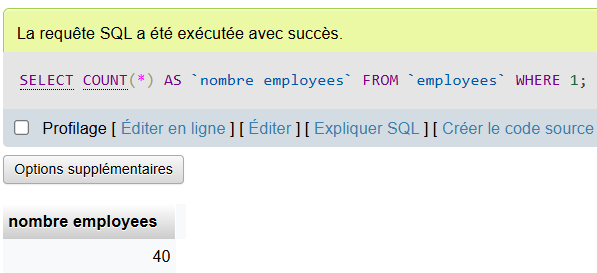
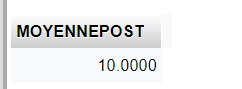
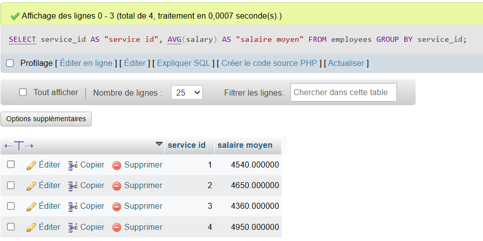

# Exercice 2

## nombre de posts par auteur

```SQL

SELECT 
    author_id, COUNT(*) AS post_count
FROM 
    posts
GROUP BY 
    author_id
ORDER BY 
    post_count DESC;

```



## nombre de post moyen par auteur

```SQL

SELECT 
    AVG(POSTCOUNT) AS MOYENNEPOST
FROM (
    SELECT 
        author_id, COUNT(*) AS POSTCOUNT
    FROM 
        posts
    GROUP BY 
        author_id
) AS POSTAUTEUR;

```



## liste des auteurs (nom et prenom) dont les posts sont supérieurs à 10 avec la clause having

```SQL

SELECT 
    *, COUNT(posts.id) AS POSTCOUNT
FROM 
    authors
JOIN 
    posts 
ON 
    authors.id = posts.author_id
GROUP BY 
    authors.id, authors.first_name, authors.last_name
HAVING 
    COUNT(posts.id) > 10;

```



## liste des auteurs (nom et prenom) dont les posts sont supérieurs à 10 avec une sous-requête


```SQL

```

## Liste des auteurs qui ont créé plus de post que la moyenne.

```SQL

```