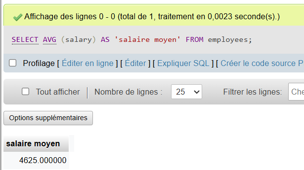
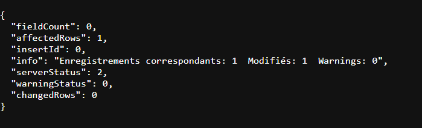
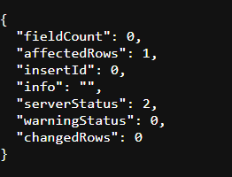

# Evaluation

## D'écrire le script SQL permettant de créer cette base de données (à destination de mysql, mariadb ou postgreSQL)

```SQL
CREATE DATABASE company;

CREATE TABLE services (
    id INT AUTO_INCREMENT PRIMARY KEY,
    name VARCHAR(255) NOT NULL,
    office_number INT NOT NULL
);

CREATE TABLE employees (
    id INT AUTO_INCREMENT PRIMARY KEY,
    first_name VARCHAR(255) NOT NULL,
    last_name VARCHAR(255) NOT NULL,
    email VARCHAR(190) UNIQUE NOT NULL,
    salary DECIMAL(10, 2) NOT NULL,
    service_id INT,
    FOREIGN KEY (service_id) REFERENCES services(id) ON DELETE SET NULL
);

CREATE TABLE manage (
    service_id INT,
    employee_id INT,
    start_date DATE NOT NULL,
    PRIMARY KEY (service_id, employee_id),
    FOREIGN KEY (service_id) REFERENCES services(id) ON DELETE CASCADE,
    FOREIGN KEY (employee_id) REFERENCES employees(id) ON DELETE CASCADE
);

```

## De créer les requêtes qui permettront de trouver les informations suivantes :

### Nombre d'employés total

```SQL
SELECT COUNT(*) AS `nombre employees` FROM `employees` WHERE 1;
```


### Moyenne des salaires de l'entreprise

```SQL
SELECT AVG (salary) AS 'salaire moyen' FROM employees;
```



### Moyenne des salaires par service

```SQL
SELECT service_id AS "service id", AVG(salary) AS "salaire moyen" FROM employees GROUP BY service_id;
```


## De créer les procédures stockées permettant de retrouver les données suivantes :

### Le classement du nombre d'employés par service

```SQL
CREATE PROCEDURE ProcedureNombreEmployeesParService() 
BEGIN SELECT services.name AS "nom du service", COUNT(employees.id) AS "nombre employees" 
FROM employees 
JOIN services ON employees.service_id = services.id 
GROUP BY services.name 
ORDER BY "nombre employees" DESC; 
END;
```


### Le top 5 des services par masse salariale
(ici je vais faire un top 3 car je n'ai pas générer assez de service pour le test)

```SQL
CREATE PROCEDURE top3DesServiceMasseSalariale() 
BEGIN SELECT services.name AS "nom du service", SUM(employees.salary) AS "masse salariale" 
FROM employees 
JOIN services ON employees.service_id = services.id 
GROUP BY services.name 
ORDER BY "masse salariale" DESC LIMIT 3; 
END;
```


###  La liste des managers et le service dont ils s'occupent


```SQL
CREATE PROCEDURE ListeManagerDesService() 
BEGIN SELECT employees.first_name AS "prenom manager", employees.last_name AS "nom manager", services.name AS "nom du service", manage.start_date AS "date de début" 
FROM manage 
JOIN employees ON manage.employee_id = employees.id 
JOIN services ON manage.service_id = services.id 
ORDER BY services.id; 
END;

```


### De créer une fonction permettant de trouver l'écart entre le plus gros et le plus petit salaire de l'entreprise


```SQL
CREATE FUNCTION differenceSalaireMax() 
RETURNS INT 
RETURN (
    SELECT MAX(salary) - MIN(salary) AS "différence salaire" 
    FROM employees
    );

```


## Vous ajouterez un/des scripts afin de pouvoir :

### Chercher un employé à partir de son identifiant

```js
const getEmployeeById = async (employeeId) => {
    try {
    const [results, fields] = await connexion.query('SELECT * FROM employees where id=?', [employeeId])
    return results;
    } catch (error) {
    console.log(error)
    return null;
    }
}
```


### Chercher un manager en fonction du service

```js
const getManagerByServiceId = async (serviceId) => {
    try {
    const [results, fields] = await connexion.query(`SELECT * 
        FROM employees 
        INNER JOIN manage 
        ON employees.id = manage.employee_id 
        WHERE manage.service_id = ?;`, [serviceId])
    return results;
    } catch (error) {
    console.log(error)
    return null;
    }
}
```


### d'ajouter, supprimer, modifier un salarié

#### Ajouter

```js
const addEmployee = async (first_name, last_name, email, salary, service_id) => {
    try {
    const [results, fields] = await connexion.query(`INSERT INTO employees (first_name, last_name, email, salary, service_id) 
        VALUES (?, ?, ?, ?, ?);`, [first_name, last_name, email, salary, service_id]);
    return results;
    } catch (error) {
    console.log(error)
    return null;
    }
}
```


#### Supprimer

```js
const deleteEmployeeByid = async (employeeIdId) => {
    try {
    const [results, fields] = await connexion.query(`DELETE FROM employees WHERE id = ?;`,[employeeIdId]);
    return results;
    } catch (error) {
    console.log(error)
    return null;
    }
}
```


#### Modifier

```js
const updateEmployeeByid = async (employeeId,first_name, last_name, email, salary, service_id) => {
    try {
    const [results, fields] = await connexion.query(`UPDATE employees
            SET first_name = ?, last_name = ?, email = ?, salary = ?, service_id = ?
            WHERE id = ?;
        `,[first_name, last_name, email, salary, service_id,employeeId]);
    return results;
    } catch (error) {
    console.log(error)
    return null;
    }
}
```


### d'ajouter, supprimer, modifier un service

#### Ajouter

```JS
const addService = async (name, office_number) => {
    try {
        const [results] = await connexion.query(
            `INSERT INTO services (name, office_number) VALUES (?, ?);`,
            [name, office_number]
        );
        return results;
    } catch (error) {
        console.error("Erreur dans addService :", error);
        throw error;
    }
};
```


#### Modifier

```JS
const updateServiceById = async (serviceId, name, office_number) => {
    try {
        const [results] = await connexion.query(
            `UPDATE services
             SET name = ?, office_number = ?
             WHERE id = ?;`,
            [name, office_number, serviceId]
        );
        return results;
    } catch (error) {
        console.error("Erreur dans updateServiceById :", error);
        throw error;
    }
};

```



#### Supprimer

```JS
const deleteServiceById = async (serviceId) => {
    try {
        const [results] = await connexion.query(
            `DELETE FROM services WHERE id = ?;`,
            [serviceId]
        );
        return results;
    } catch (error) {
        console.error("Erreur dans deleteServiceById :", error);
        throw error;
    }
};
```



## Exécuter chaque procédure stockée


```JS
const procedureDifferenceSalaire = async () => {
    try {
    const [results, fields] = await connexion.query('SELECT differenceSalaireMax()')
    return results;
    } catch (error) {
    console.log(error)
    return null;
    }
}
```


```JS
const procedureListeManagerDesService = async () => {
    try {
    const [results, fields] = await connexion.query('CALL ListeManagerDesService()')
    return results;
    } catch (error) {
    console.log(error)
    return null;
    }
}
```


```JS
const proceduretop3DesServiceMasseSalariale = async () => {
    try {
    const [results, fields] = await connexion.query('CALL top3DesServiceMasseSalariale()')
    return results;
    } catch (error) {
    console.log(error)
    return null;
    }
}
```


```JS
const ProcedureNombreEmployeesParService = async () => {
    try {
    const [results, fields] = await connexion.query('CALL ProcedureNombreEmployeesParService()')
    return results;
    } catch (error) {
    console.log(error)
    return null;
    }
}
```

